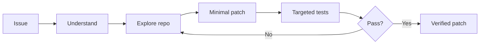

*"If I quit now, they win."*

---

## 👩‍💻 About me

I work where **business meets technology**. I take real processes apart, understand where they break, and rebuild them with AI, automation and well-crafted software.

I'm a digital transformation professional at **Línea Directa**, and over the last two years I've turned that business perspective into hands-on engineering: from Power Platform agents and generative AI pipelines to full-stack JavaScript applications with tests, accessibility checks and production deployments.

I learn by building — and I document what I build. Most repositories here include a technical report (`MEMORIA.md`), bilingual documentation, real screenshots and an honest record of what was tested and what wasn't.

---

## 🚀 Now building

### [tAilorCode — Autonomous coding agent powered by Gemma 4](https://github.com/AraceliFradejas/tailorcode-gemma-developer-agent)

My submission to the **Google – The Gemma 4 Developer Agent Competition** (Google DeepMind × Kaggle). tAilorCode receives a repository issue, explores the codebase, makes a minimal source change, runs targeted tests and returns a verifiable Git patch — evaluated on real-world Python bug fixes and feature requests.

It's the natural evolution of my earlier customer-support and autonomous-agent work: instead of resolving a customer incident, the agent resolves a software issue.

`Gemma 4` `Google ADK` `Multi-agent` `Sub-agents` `Kaggle` `Python`

---

## ⭐ Flagship projects

<table>
<tr>
<td width="50%" valign="top">

### 🛸 [The X-Files · Case Archive](https://github.com/AraceliFradejas/RTC-PROYECTO11-REACT-BASIC)
Full-stack React archive of **218 episodes across 11 seasons**, imported from TMDB into MongoDB Atlas. Search, filters, favourites and viewing progress, streaming availability by country, and a complete interface in **Spanish, English and German**. Own API and frontend served from the same Vercel domain.

`React` `React Router` `Express` `MongoDB Atlas` `TMDB` `Cloudinary` `i18n`

[**Live demo →**](https://xfiles-archive.vercel.app/)

</td>
<td width="50%" valign="top">

### 🖋️ [The Tortured Poets Challenge](https://github.com/AraceliFradejas/RTC-PROYECTO12-REACT-AVANZADO)
Taylor Swift or Shakespeare? A literary game in three chapters with timed mode, hints, drag-and-drop timeline and a session notebook. Built with `useReducer` and custom hooks, prerendered for SEO in ES/EN, and verified with **Vitest, Playwright and axe-core**.

`React` `useReducer` `Custom hooks` `Vitest` `Playwright` `axe-core` `a11y`

[**Live demo →**](https://the-poets-archive.vercel.app)

</td>
</tr>
<tr>
<td width="50%" valign="top">

### 🤖 [Customer Feedback GenAI Suite](https://github.com/AraceliFradejas/Capstone-Project---Desarrollador10X-IIA---Araceli-Fradejas)
End-to-end generative AI solution for automated customer feedback analysis: an OpenAI + Gemini analysis notebook, a Gradio app for call-centre agents with language detection, and an executive Streamlit dashboard with PDF reporting. Capstone of the Desarrollador 10X programme (Instituto de Inteligencia Artificial).

`OpenAI` `Gemini` `LangChain` `RAG` `Gradio` `Streamlit` `ReportLab`

</td>
<td width="50%" valign="top">

### 🏉 [KelseTS Talks · Full-Stack Events Platform](https://github.com/AraceliFradejas/RTC-PROYECTO10-FULL-STACK-JAVASCRIPT)
Events platform where attendees register, book and cancel seats, and organisers create their own experiences. Bilingual agenda with 12 talks, idempotent seeding, accent-insensitive search across translations, authentication and Cloudinary uploads.

`Node.js` `Express` `MongoDB Atlas` `JWT` `Cloudinary` `i18n`

</td>
</tr>
</table>

---

## 🗂️ All projects

### 🤖 AI, GenAI & Agents

| Project | What it does | Stack |
|---|---|---|
| [**tAilorCode**](https://github.com/AraceliFradejas/tailorcode-gemma-developer-agent) | Autonomous coding agent that repairs Python repositories and verifies its patches with tests. | `Gemma 4` `Google ADK` `Python` |
| [**Customer Feedback GenAI Suite**](https://github.com/AraceliFradejas/Capstone-Project---Desarrollador10X-IIA---Araceli-Fradejas) | Feedback analysis, agent-facing app and executive dashboard with PDF reports. | `OpenAI` `Gemini` `LangChain` `Streamlit` `Gradio` |
| [**Google × Kaggle GenAI Capstone**](https://github.com/AraceliFradejas/Kaggle-Google-Capstone-Project) | Capstone notebook and deliverables from the GenAI Intensive Course (2025 Q1). | `Python` `Gemini` `Jupyter` |

### ⚡ Microsoft Power Platform & Copilot Studio

| Project | What it does | Stack |
|---|---|---|
| [**Autonomous Agents**](https://github.com/AraceliFradejas/Power-Up-challenge-Autonomous-Agents-v1.0) | Agents that validate business logic and NIFs, generate JSON and produce PDFs. [Behind the scenes on Medium](https://medium.com/@araceli.fradejas/from-flow-errors-to-love-story-my-final-challenge-at-microsoft-power-up-49f7d2de1521). | `Copilot Studio` `Power Automate` |
| [**Conversational Agents**](https://github.com/AraceliFradejas/Power-Up-challenge-Conversational-Agents-v1.0) | Conversational assistant that generates software requirements on demand. | `Copilot Studio` |
| [**End-to-end Power Platform Solution**](https://github.com/AraceliFradejas/Power-Up-Challenge-Power-Up-Challenge-v1.0) | Dataverse, Canvas and Model-driven apps, Power Automate flows and Power BI reporting. | `Dataverse` `Power Apps` `Power BI` |

### ⚛️ React & Full-Stack

| Project | What it does | Stack |
|---|---|---|
| [**The Tortured Poets Challenge**](https://github.com/AraceliFradejas/RTC-PROYECTO12-REACT-AVANZADO) | Accessible literary game with prerendering, E2E and a11y tests. [Live](https://the-poets-archive.vercel.app) | `React` `Vitest` `Playwright` |
| [**The X-Files · Case Archive**](https://github.com/AraceliFradejas/RTC-PROYECTO11-REACT-BASIC) | Trilingual episode archive with own API and real data. [Live](https://xfiles-archive.vercel.app/) | `React` `Express` `MongoDB` |
| [**KelseTS Talks**](https://github.com/AraceliFradejas/RTC-PROYECTO10-FULL-STACK-JAVASCRIPT) | Full-stack events platform with auth, bookings and uploads. | `Node.js` `MongoDB` `Cloudinary` |
| [**React Hooks · Rick and Morty**](https://github.com/AraceliFradejas/ejerciciosES7-hooksreact) | Hooks practice: data fetching, props and independent card state. | `React` `Vite` |

### 🧩 Backend, APIs & Web Scraping

| Project | What it does | Stack |
|---|---|---|
| [**Books to Scrape**](https://github.com/AraceliFradejas/RTC-PROYECTO9-WEB-SCRAPPING-) | Scraper for 50 pages / 1,000 books, extended into a REST API with 14 automated tests. | `Puppeteer` `Express` `MongoDB` |
| [**The Eras Tour Archive API**](https://github.com/AraceliFradejas/RTC-PROYECTO8-API-REST-FILES) | 149 concerts and 238 songs with relations and a full Cloudinary file lifecycle. | `Express` `MongoDB` `Multer` `Cloudinary` |
| [**Hogwarts Auth API**](https://github.com/AraceliFradejas/RTC-PROYECTO7-API-REST-AUTH) | Users, houses and wands with JWT, password hashing and role-based permissions. | `Express` `JWT` `bcrypt` |
| [**Taylor Swift Discography API**](https://github.com/AraceliFradejas/RTC-PROYECTO6-API-REST) | Relational CRUD API with idempotent seeds and a bilingual frontend. [Live](https://ret-proyecto6-api-rest.vercel.app/) | `Express` `MongoDB Atlas` `Mongoose` |

### 🌐 Frontend & Web

| Project | What it does | Stack |
|---|---|---|
| [**Games Hub**](https://github.com/AraceliFradejas/RTC-PROYECTO5-GAMES-HUB) | Three modular browser games with persistent scores. [Live](https://rtc-proyecto-5-games-hub.vercel.app/) | `Vite` `JavaScript` |
| [**AFM Portfolio**](https://github.com/AraceliFradejas/RTC-PROYECTO4-PORTFOLIO) | Bilingual component-based portfolio. [Live](https://rtc-proyecto4-portfolio.vercel.app/) | `Vite` `JavaScript` |
| [**AFM Inspiration**](https://github.com/AraceliFradejas/Proyecto-RTC-PROYECTO-PINTEREST-ASYNC) | Pinterest-style gallery with async search on the Unsplash API. [Live](https://proyecto-rtc-proyecto-pinterest-asy.vercel.app/) | `Vite` `Unsplash API` |

### 📊 Data & BI

| Project | What it does | Stack |
|---|---|---|
| [**Master The Power · Power BI**](https://github.com/AraceliFradejas/MasterThePower_PBI-ejercicios-y-retos_AraceliFradejasMu-oz) | Advanced data visualisation challenges and dashboards. | `Power BI` `DAX` |

<b>🌱 Early projects</b>

 

| Project | Notes |
|---|---|
| [KelseTS Business School Landing](https://github.com/AraceliFradejas/KelseTsBusinessSchoolLanding) | Animated responsive landing page for the Power Up Parking Challenge. |
| [SOS Expats](https://github.com/AraceliFradejas/SOS_Expats) | Web prototype for an expat relocation business idea. |
| [Oniria](https://github.com/AraceliFradejas/oniria) | Creative, immersive landing page experiment. |
| [Landing Page 1](https://github.com/AraceliFradejas/Proyecto-LANDING-PAGE-1) | My first layout and front-end design project. |

---

## 🛠️ How I work

- **Evidence over claims** — every project documents what was tested, how, and what remains pending.
- **Testing where it matters** — Vitest, Playwright, axe-core, `node:test` and Supertest.
- **Accessibility by default** — semantic HTML, keyboard navigation, focus management and reduced motion.
- **Multilingual from day one** — ES/EN interfaces and documentation; ES/EN/DE when the story calls for it.
- **Secrets hygiene** — `.env.example` templates, private variables and no credentials in Git.
- **AI-assisted, human-directed** — `AGENTS.md` files that define how AI tools collaborate on my codebases.

---

## 🧠 Tech stack

**AI & Agents**

**Frontend**

**Backend & Data**

**Testing & Quality**

**Microsoft Power Platform**

**Tools & Deploy**

---

## 🎓 Learning path

- **Rock The Code** · The Power Tech School — Full-stack master: web design, backend (Node, MongoDB, REST APIs), full-stack JavaScript and React.
- **Desarrollador 10X** · Instituto de Inteligencia Artificial — Generative AI applications (April 2025).
- **GenAI Intensive Course** · Google × Kaggle (2025 Q1).
- **Microsoft Power Up** — Power Platform, Copilot Studio and autonomous agents.
- **Master The Power** · Power BI.

---

## 🔬 In the lab

- **Coding agents** — evaluating Gemma 4 agents on real repository issues with Google ADK.
- **Agent evaluation** — resolution rate, targeted tests and reproducible offline submissions.
- **LLM comparisons** — OpenAI vs Gemini vs local models (Ollama) on real business use cases.
- **RAG & semantic search** — LangChain pipelines and vector databases.

---

*Built with ☕, determination and way too many open tabs — from Madrid 🇪🇸*

